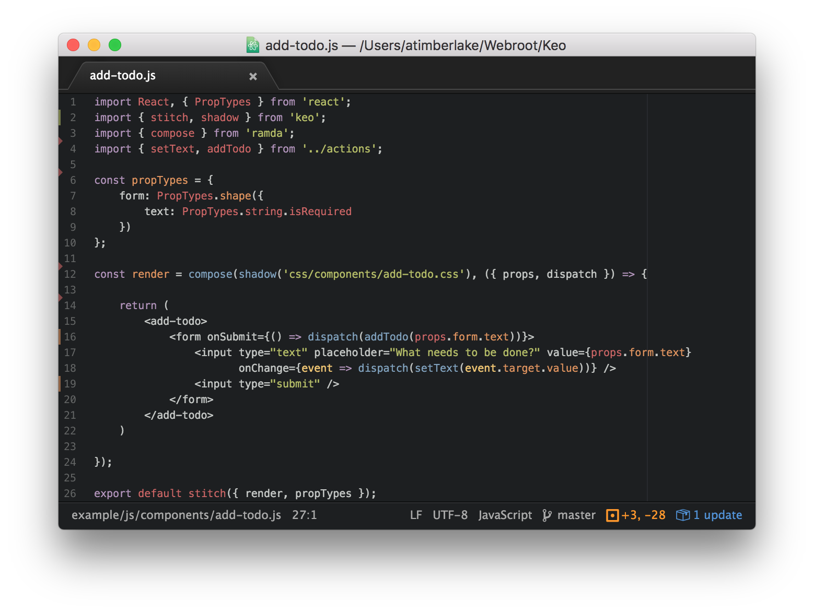

> <sub><sup>*["Keo"](https://vi.wikipedia.org/wiki/Keo) is the Vietnamese translation for glue.*</sup></sub><br />
> Plain functions for a more functional [Deku](https://github.com/dekujs/deku) approach to creating React components, with functional goodies such as compose, memoize, etc... for free.


&nbsp;

&nbsp;


* **npm:** `npm install keo --save`



## Table of Contents

* [Advantages](#advantages)
* [Getting Started](#getting-started)
* [Destructuring](#destructuring)
* [Nonstandard Properties](#nonstandard-properties)

At the core of Keo's philosophies is the notion that you **shouldn't** have to deal with the `this` keyword &mdash; and while in ES2015 the `this` keyword has become easier to manage, it seems wholly unnecessary in a React component. As such, Keo takes a more [Deku](https://github.com/dekujs/deku) approach in that items such as `props`, `context`, `nextProps`, etc... are passed in to [*some*](#lifecycle-functions) React [lifecycle functions](https://facebook.github.io/react/docs/component-specs.html).

Since `v4.x`, Keo has taken on a more fundamental interpretation of React where components are **expected** to be passed immutable properties &mdash; and `state` is entirely inaccessible, as is `setState` to prevent components from holding their own state. As such, you are **required** to use Redux with Keo to pass properties down through your components.

> **Note:** Prior to `v4.x` Keo had a different API which was more tolerant &mdash; please use `npm i keo@3.0.2` &mdash; [See associated README](LEGACY.md)

---

## Advantages

* Steer away from `class` sugaring, inheritance, and `super` calls;
* Create referentially transparent, pure functions without `this`;
* Gain `memoize`, `compose`, et cetera... for gratis with previous;
* Use `export` to export plain functions for simpler unit-testing;
* Simple composing of functions for [*mixin* support](https://github.com/dekujs/deku/issues/174);
* Avoid functions being littered with React specific method calls;
* Integrated `shouldComponentUpdate` performing immutable equality checks from `propTypes`;
* An assumption that [immutable properties](http://www.sitepoint.com/immutability-javascript/) are used for performance gains;
* Use `render` composition to enable [Shadow DOM](http://www.html5rocks.com/en/tutorials/webcomponents/shadowdom/) support in React;

## Getting Started

Use [Redux](https://github.com/reactjs/redux) to pass down properties through your components, and an immutable solution &mdash; such as [`seamless-immutable`](https://github.com/rtfeldman/seamless-immutable) or Facebook's [`Immutable`](https://facebook.github.io/immutable-js/) &mdash; even [`Object.freeze`](https://developer.mozilla.org/en-US/docs/Web/JavaScript/Reference/Global_Objects/Object/freeze) can in many cases be perfectly acceptable for getting started.

Once you're setup with Redux, and your project is passing down immutable properties, within your first component you can import `stitch` from Keo. In the following example we'll assume the immutable property `name` is being passed down to your component:

```javascript
import React from 'react';
import { stitch } from 'keo';

const render = ({ props }) => {
    return <h1>{props.name}</h1>
};

export stitch({ render });
```

In the above example the component will re-render **every time** properties are updated in your Redux state &mdash; even when the `name` property hasn't been changed. React provides the [`PureRenderMixin` mixin](https://facebook.github.io/react/docs/pure-render-mixin.html) for these instances, and Keo provides a similar solution.

Taking advantage of the `shouldComponentUpdate` improvement you **must** define `propTypes` &mdash; Keo favours this approach over checking `props` directly to encourage strictness in component definitions:

```javascript
import React, { PropTypes } from 'react';
import { stitch } from 'keo';

const propTypes = {
    name: PropTypes.string.isRequired
};

const render = ({ props }) => {
    return <h1>{props.name}</h1>
};

export stitch({ propTypes, render });
```

With the above component definition **only** when the `name` property has changed will the component re-render &mdash; in many cases this provides a [huge performance gain](https://facebook.github.io/react/docs/advanced-performance.html). It's important to benchmark your React applications using tools such as [`react-addons-perf`](https://facebook.github.io/react/docs/perf.html) &mdash; and in particular the `printWasted` function which will demonstrate the benefit of using `shouldComponentUpdate`.

## Destructuring

In keeping with one of Keo's philosophies that the `this` keyword should be avoided &ndash; Keo provides a way to destructure required arguments from within your components:

```javascript
const componentDidMount = ({ props }) => {
    setState({ lifeRemaining: Math.floor(Math.random() * 10) + 1 });
};
```

Properties which can be destructured are as follows:

* `props` which are passed down via Redux;
* `dispatch` which is an alias for `props.dispatch`;
* `context` allowing access to such modules are `router`;

Properties which are typically available in React components, but are unavailable in Keo components:

* `state` as components cannot read local state;
* `setState` forbidden to write local state;
* `refs` use `event.target` on events instead;
* `forceUpdate` as components are only updated via `props`;

## Lifecycle Functions

The entire gamut of [React's lifecycle methods](https://facebook.github.io/react/docs/component-specs.html) pass in their own associated arguments &mdash; for example the `render` method will take `props`, `context` and `dispatch`, whereas other functions such as `componentWillUpdate` would also take an additional `nextProps` argument.

You may override the `shouldComponentUpdate`, however the provided function is fine in most cases assuming that your [`propTypes` are accurate](#getting-started).

## Nonstandard Properties

Below are a handful of additional nonstandard properties which can be destructured in all lifecycle methods.

* [`id`](#id) &mdash; for managing local state in the Redux tree structure;
* [`args`](#args) &mdash; accessing **all** arguments for passing to other functions;

### `id`

For managing [pseudo-local state](https://github.com/reactjs/redux/issues/159) in a single tree state you can use the `id` property &mdash; which is a unique [`Symbol`](https://developer.mozilla.org/en/docs/Web/JavaScript/Reference/Global_Objects/Symbol) representing the current component. When dispatching actions you should pass the `id` as the payload, and then pass the `id` back as part of the result &mdash; with that information it's simple to determine when a component *should* be updated.

```javascript
const render = ({ id }) => {
    return <a onClick={dispatch(setValue('United Kingdom', id))}></a>;
};
```

You may also prevent other components from updating by using the `shouldComponentUpdate` function to determine when the action applies to the current component. It's worth noting that a custom `shouldComponentUpdate` will simply be composed with the Keo default `shouldComponentUpdate` which inspects the `propTypes` for a significant performance enhancement.

```javascript
const shouldComponentUpdate = (({ id, props }) => {
    return props.select.id === id;
});
```

**Note:** Will also check `propTypes` if they have been defined on the component.

### `args`

In Haskell you have `all@` for accessing **all** of the arguments in a function, even after listing the arguments &mdash; with JavaScript you have the nonstandard `arguments` however with Keo `args` can be destructured to provide access to **all** of the arguments passed in, allowing you to forward these arguments to other functions.

```javascript
const componentDidUpdate = ({ props, context, args }) => {
    const name = parseName(args);
    // ...
};
```

Which then allows you to destructure the arguments in the `parseName` function as though it's a typical lifecycle React method.
