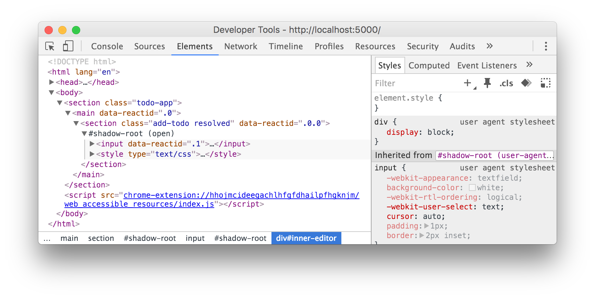

> <sub><sup>*["Keo"](https://vi.wikipedia.org/wiki/Keo) is the Vietnamese translation for glue.*</sup></sub><br />
> Plain functions for a more functional [Deku](https://github.com/dekujs/deku) approach to creating stateless React components, with functional goodies such as compose, memoize, etc... for free.



> As Shadow DOM is part of the [webcomponents](https://developer.mozilla.org/en-US/docs/Web/Web_Components) suite, there is a [useful polyfill](https://github.com/webcomponents/webcomponentsjs) which you can use for wider browser support &mdash; please refer to their documentation for a [list of supported browsers](https://github.com/webcomponents/webcomponentsjs#browser-support).

**Note:** Currently does not work in React `15.x` &mdash; [see issue](https://github.com/facebook/react/issues/6456) and [associated PR](https://github.com/facebook/react/pull/6462).

---

# Shadow DOM

By using function composition in Keo, you are able to add additional behaviour to your functions by using `compose` or `pipe` &ndash; in this case we are using the bundled `shadow` function to enable [Shadow DOM](https://developer.mozilla.org/en-US/docs/Web/Web_Components/Shadow_DOM) in React.

## Getting Started

In order to use Shadow DOM you need to `compose` your `render` function, which means importing [`compose`](http://ramdajs.com/0.19.1/docs/#compose) &mdash; or [`pipe`](http://ramdajs.com/0.19.1/docs/#pipe) &mdash; from Ramda, along with `shadow` from Keo and then composing your `render` function.

```javascript
import { compose } from 'ramda';
import { stitch, shadow } from 'keo';

// ...

const render = compose(shadow(), ({ props }) => {
    return (
        <section className="greeting">
            <h1>Hello ${props.name}</h1>
        </section>
    );
});
```

Once you have the composition setup with `shadow` you should find your DOM rendering with a shadow root. Keo takes your component's root element and appends that to the DOM tree; it then creates a shadow root and renders your component's `children` inside.

**Note:** If you have only one child then your component will be rendered directly beneath the shadow root, otherwise due to a [well-known React limitation](https://github.com/facebook/react/issues/2127), a `span` will be the immediate descendent of the shadow root, and your component will be rendered within that `span`.

You should see the following when inspecting the DOM:

```html
<section class="greeting resolved">
    #shadow-root (open)
        <h1>Hello Adam</h1>
</section>
```

Any event listeners and other props on your root `section` element will be transferred across and therefore work as you would expect.

## CSS Documents

You may have noticed that when composing your `render` function that you're invoking `shadow` instead of simply passing it in &ndash; that is because the `shadow` function is curried and accepts **two** arguments: the first being a `string` or an `array` of stylesheets, and the second being the result of your `render` function which `compose` &mdash; or `pipe` &mdash; will handle for you.

Therefore to pass in stylesheets to be used with your component, simply pass in a path to your CSS document(s):

```javascript
const render = compose(shadow('/css/greeting.css'), ({ props }) => {
    return (
        <section className="greeting">
            <h1>Hello ${props.name}</h1>
        </section>
    );
});
```

You should now see the following DOM structure with the `style` element applied next to your component:

```html
<section class="greeting resolving">
    #shadow-root (open)
        <h1>Hello Adam</h1>
        <style type="text/css" />
</section>
```

### FOUC

As the stylesheets are downloaded asynchronously, there is a small period of time where your component *will* be rendered without the styles applied &mdash; this is known as a [flash of unstyled content (FOUC)](https://en.wikipedia.org/wiki/Flash_of_unstyled_content). For these purposes it may be useful to hide your component until the styles have been applied &mdash; that is the reason for Keo appending `resolved` or `resolving` to your component's root element:

```html
<section class="greeting resolving">
    #shadow-root (open)
        <h1>Hello Adam</h1>
        <style type="text/css" />
</section>
```

When the component has the class name `resolving` then it may be wise to hide the element, or at least let users know the component hasn't yet finished rendering. However once the class name is `resolved` then the component should have **all** the styles it needs to be displayed beautifully.

## Pipe

It's been mentioned that you could also use `pipe` to place the `shadow` function at the end for readability purposes &mdash; whichever you choose is entirely up to you &mdash; but don't forget to be consistent across components!

```javascript
import { pipe } from 'ramda';
import { stitch, shadow } from 'keo';

// ...

const render = pipe(({ props }) => {
    return (
        <section>
            <h1>Hello ${props.name}</h1>
        </section>
    );
}, shadow(['/css/greeting.css', '/css/headers.css']));
```
